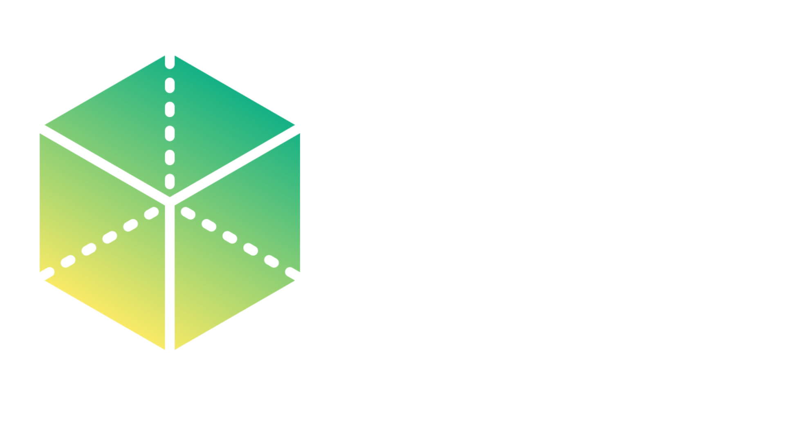
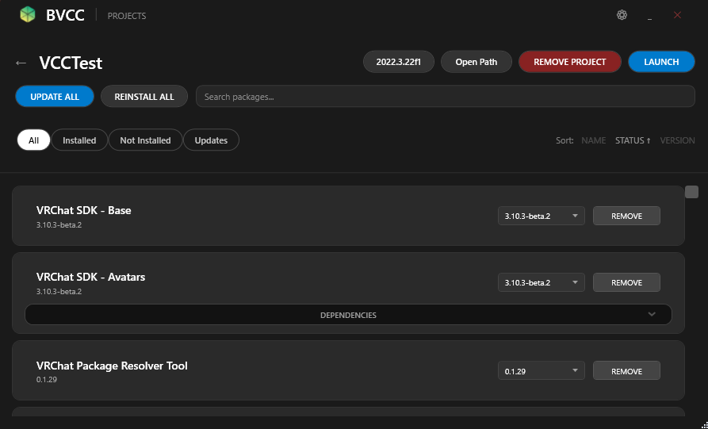
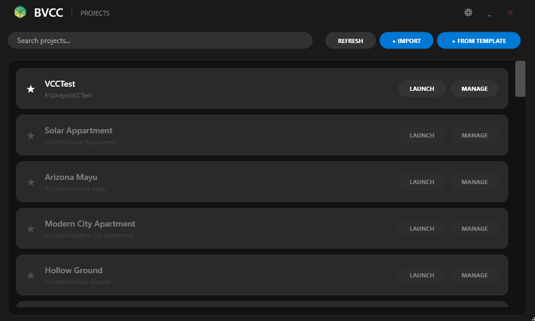
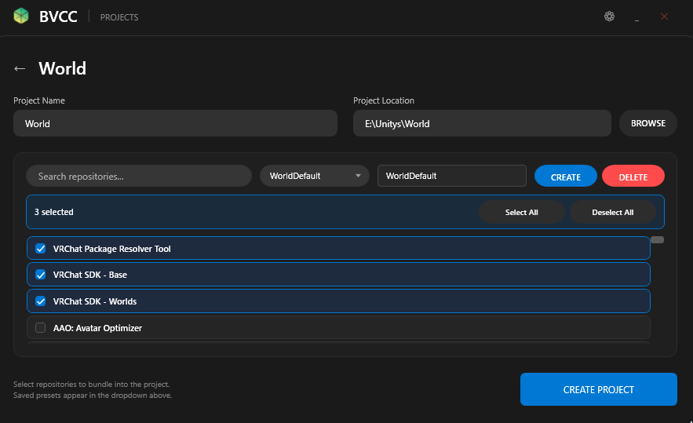

# Better VRChat Creator Companion (BVCC)

  

  <strong>An enhanced, high-performance alternative to the standard VRChat Creator Companion.</strong>

  <a href="#-setup">Setup</a> •
  <a href="#-features">Features</a> •
  <a href="#-recommended-repos">Recommended Repos</a> •
  <a href="#-screenshots">Screenshots</a>

---

## 🚀 Overview
**BVCC** is a custom tool designed to improve quality of life and workflow efficiency for VRChat creators. It provides a faster, more intuitive interface while maintaining full compatibility with your existing projects.

## ✨ Features
* **Seamless Migration:** Import all your projects directly from the official VCC.
* **Streamlined UI:** Clean, modern interface designed for speed.
* **Package Management:** Easy handling of VPM repositories and dependencies.
* **Lightweight:** Optimized to use fewer resources than the standard companion.

## 📸 Screenshots

| Main Dashboard | Package Manager |
| :---: | :---: |
|  |  |

  <strong>Advanced Settings</strong> 
  

## 🛠 Setup

1. **Download:** Get the latest installer from the [Releases](link-to-your-release) page.
2. **Install:** Run the executable and launch BVCC.
3. **Import:** * Go to **Settings** → **Import From VCC**.
   * Select your Creator Companion’s `settings.json` file.

## 📦 Recommended Repos

Copy and paste these URLs into your repository settings to expand your toolset:

* **VPM Curated:** `https://vrchat-community.github.io/vpm-listing-curated/index.json`
* **VRChat Official:** `https://vrchat.github.io/packages/index.json` (Included by default)

---

### 🤝 Contributing
Suggestions and bug reports are welcome! Please open an **Issue** or submit a **Pull Request**.

### 📄 License
This project is licensed under the [MIT License](LICENSE).